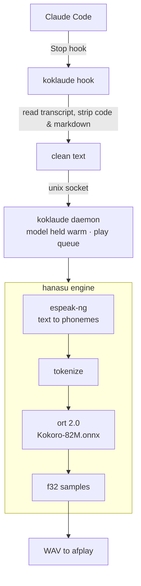

# koklaude

<p align="center">
    
</p>

**Local, offline text-to-speech for Claude Code.** 
Claude finishes a reply — and *speaks* it aloud, on your machine, with no cloud, no subscriptions and no API keys.

It uses the open-weight [Kokoro-82M](https://huggingface.co/hexgrad/Kokoro-82M) TTS model, based on the [StyleTTS 2](https://arxiv.org/abs/2306.07691)
family of models.

> Status: **early / design phase.** 
> The architecture is settled; the engine is being built step by step. Nothing here works end-to-end yet.

---

## Why

Coding and especially brainstorming with an assistant is a read-heavy loop: 
you skim a wall of text, often in a small terminal, find the one sentence or idea that matters, then act, correct, reiterate. 
There are already many good options to "speak" **to** coding agents, including some built-in features and plugin, but there is - at least to my knowledge - very little in the
other direction: let the assistant speak loud the answer.

Koklaude (kokoro + claude) turns the assistant's reply into *audio* so you can keep your eyes on the editor (or look away entirely) 
and still follow what it did. Pair it with any speech-to-text input (Claude Code's built-in voice mode, Spokenly, Whisper) and the loop becomes conversational.

Three hard requirements shaped every decision:

1. **Safe** — runs fully on-device. Your code and the assistant's replies never leave the machine.
2. **Free & local** — the [Kokoro-82M](https://huggingface.co/hexgrad/Kokoro-82M) model runs locally via ONNX. No subscription, no key.
3. **Toggleable** — flip speech on/off instantly (`koklaude on` / `koklaude off`), no uninstall, no restart.

## Why *another* TTS-for-Claude project

There's already a couple of good projects in this direction, e.g. [`ybouhjira/claude-code-tts`](https://github.com/ybouhjira/claude-code-tts) (Go) and a few Rust Kokoro wrappers. I looked at each before writing a line:

| Project                     | What it is                              | Why not for this                                                                                                                             |
|-----------------------------|-----------------------------------------|----------------------------------------------------------------------------------------------------------------------------------------------|
| `ybouhjira/claude-code-tts` | Go plugin, Stop hook + worker pool      | Uses the **OpenAI cloud TTS API** — pay to use, and sends every reply to a third party. Fails "safe" and "free/local". Also hard to turn-off |
| `kokoroxide` (crate)        | MIT/Apache, clean in-process lib API    | **Dead**: pins `ort = "^1.16"`, and every `ort 1.16.x` is yanked. Uninstallable, ~8 months stale.                                            |
| `kokorox` / `Kokoros`       | Rust Kokoro, installable (`ort 2.0-rc`) | Shaped as a CLI/server, not a clean library.                                                                                                 |

None met *safe, free/local, small, embeddable*. 
So koklaude rebuilds what `kokoroxide` set out to be — a clean Kokoro engine on a maintained `ort` 2.0 — as **`hanasu`**. Like every Kokoro stack that pronounces arbitrary words well, it uses `espeak-ng` for phonemes — but invoked as a **separate CLI process**, so koklaude itself stays **MIT** (see [License](#license)).

## How it works (one binary)



- **`espeak-ng`** (invoked as an external CLI) — grapheme→phoneme for arbitrary words, names, jargon, and many languages. This is what lets koklaude pronounce real-world, non-English, domain-heavy text correctly. You install it yourself ([prerequisites](docs/prerequisites.md)); calling it arm's-length keeps koklaude MIT.
- **`ort` 2.0** — runs the Kokoro ONNX model.
- A small background **daemon** keeps the model loaded so speech starts fast; it auto-spawns on first use and exits after 30 min idle.

Full detail: [`docs/architecture.md`](docs/architecture.md).

## Install & use (planned)

```bash
cargo install koklaude        # or grab a release binary
koklaude init                 # download the model, register the Stop hook
# ... that's it. Claude now speaks.

koklaude off                  # silence
koklaude on                   # speech back
koklaude say "hello there"    # manual test
```

### Standalone playback mode

`koklaude` isn't only a Claude Code hook — `koklaude say "..."` is a self-contained
TTS player: it synthesizes the text and plays it straight through your speakers,
no daemon, no hook, no Claude involved. Useful as a quick local
text-to-speech command in its own right (and how we validate the engine).

```bash
koklaude say "Local, offline text to speech in one command."
```

Voice and speed are configurable — globally via `~/.config/koklaude/config.toml`,
and per-call via `say --voice <name> --speed <n>` (a flag overrides the file).

```toml
# ~/.config/koklaude/config.toml — both keys optional; omitted = built-in default
voice = "af_heart"   # any of the 54 Kokoro voices (e.g. am_adam, bf_emma)
speed = 1.0          # pace multiplier; 1.0 = normal
```

The file is read today; `koklaude init` will write it for you (Phase 5). Precedence:
`--flag` > `config.toml` > built-in default.

### Prerequisites

`koklaude init` will eventually automate setup. Today, two things are needed on
the machine: **`espeak-ng`** and the **Kokoro model + voices** under
`~/.config/koklaude/`. See [`docs/prerequisites.md`](docs/prerequisites.md). With
those in place you can already run the Phase 1 engine spike — [`docs/spike.md`](docs/spike.md).

## Design at a glance

- **Speaks** the full reply with code blocks stripped (code read aloud is noise).
- **Never drops text**: overlapping replies queue rather than interrupt — losing half a sentence is worse than slightly stale audio.
- **Never blocks Claude Code**: any TTS error is logged and swallowed; the hook always exits cleanly.
- Everything koklaude owns lives under `~/.config/koklaude/`.

## Beyond Claude Code

The speech engine (daemon) is assistant-agnostic. 
Only the thin front end — the hook plus the transcript parser — is specific to Claude Code.
Supporting **Codex**, **pi**, or another assistant later means adding a small adapter, not a new engine. 

## License

**MIT.** Use koklaude and the `hanasu` engine freely.

koklaude doesn't bundle or link `espeak-ng` — it calls the separately installed `espeak-ng` as an **external CLI** (the way MIT tools shell out to `git` or `ffmpeg`), so espeak's GPL doesn't propagate. **You install `espeak-ng` yourself** — see [`docs/prerequisites.md`](docs/prerequisites.md). Rationale in [`docs/decisions.md`](docs/decisions.md) (D3/D4). *Not legal advice.*

## Acknowledgements

- [Kokoro-82M](https://huggingface.co/hexgrad/Kokoro-82M) by hexgrad 
- [`espeak-ng`](https://github.com/espeak-ng/espeak-ng) 
- [`ort`](https://github.com/pykeio/ort) by pykeio 

