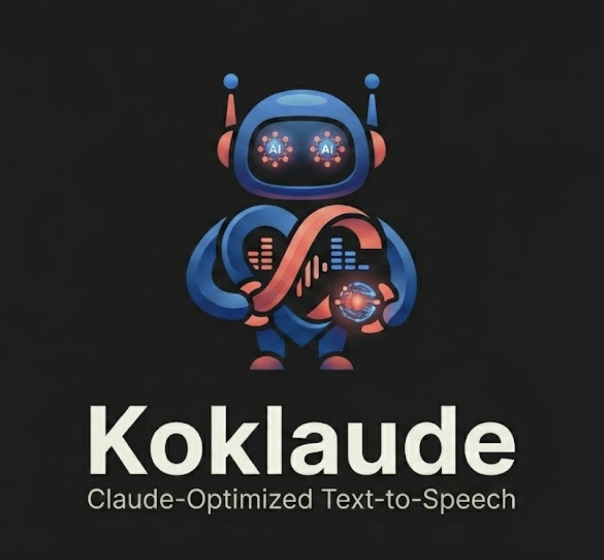

# koklaude

[](https://freepalestine.dev)

<p align="center">
    
</p>

**Local, offline text-to-speech for Claude Code and Codex.** Your assistant
finishes a reply — and *speaks* it aloud, on your machine. No cloud, no
subscription, no API keys. It runs the open-weight
[Kokoro-82M](https://huggingface.co/hexgrad/Kokoro-82M) model locally via ONNX.

> **Status: working on macOS.** `koklaude init` sets up Claude Code by default;
> `koklaude init --adapter codex` sets up Codex. A warm daemon synthesizes, and a
> Stop hook makes replies speak. `koklaude say "..."` works standalone too.
> macOS-only for now (playback uses `afplay`).

## Why

Coding with an assistant is a read-heavy loop: you skim a wall of text, find the
one sentence that matters, then act. Plenty of tools let you speak **to** an
agent — very few let it speak **back**. koklaude (kokoro + claude) turns the
reply into *audio* so you can keep your eyes on the editor and still follow what
it did. Pair it with any speech-to-text input and the loop goes conversational.

Four requirements shaped every decision:

1. **Safe** — fully on-device; your code and the replies never leave the machine.
2. **Free & local** — Kokoro-82M runs locally via ONNX. No subscription, no key.
3. **Toggleable** — flip speech on/off instantly (`koklaude on` / `off`), no restart.
4. **Debuggable** — every action and trigger is logged under `~/.koklaude/`.

---

## Getting started

Four steps: install `espeak-ng`, get the `koklaude` binary, run `init`, (optionally) configure.

### 1. Prerequisite: `espeak-ng`

The one thing `koklaude` can't install for you is **`espeak-ng`** — the
grapheme→phoneme backend that lets it pronounce arbitrary words, names, jargon,
and non-English text. It's kept arm's-length (invoked as an external CLI) so
koklaude stays MIT. Install it first:

```bash
brew install espeak-ng
```

(The Kokoro **model + voices** are downloaded automatically by `init` — you don't
fetch those yourself.) Details: [`docs/prerequisites.md`](docs/prerequisites.md).

### 2. Install `koklaude`

**Option A — prebuilt binary** (macOS, Apple Silicon). Each release attaches an
`aarch64-apple-darwin` tarball:

```bash
gh release download --repo amasotti/koklaude \
  --pattern '*-aarch64-apple-darwin.tar.gz'
tar -xzf koklaude-*-aarch64-apple-darwin.tar.gz
sudo mv koklaude /usr/local/bin/        # or anywhere on your PATH
```

The binary isn't notarized. If you download it via a browser instead of `gh`,
macOS Gatekeeper quarantines it — clear that with
`xattr -d com.apple.quarantine /usr/local/bin/koklaude`.

**Option B — from source** (any cargo target; `cargo install koklaude` from
crates.io is coming — see [`docs/plan.md`](docs/plan.md)):

```bash
git clone https://github.com/amasotti/koklaude && cd koklaude
cargo install --path crates/koklaude
```

### 3. Run `init`

```bash
koklaude init                   # default: install Claude Code Stop hook
koklaude init --adapter codex   # install Codex Stop hook
koklaude init --adapter all     # install both
```

For Codex, run `/hooks` once if prompted and trust the koklaude Stop hook.

Everyday controls:

```bash
koklaude off                  # silence (instant, no restart)
koklaude on                   # speech back
koklaude say "hello there"    # manual test (standalone, no daemon)
koklaude uninstall            # remove Claude hook (default; other hooks untouched)
koklaude uninstall --adapter codex
```

### 4. Configure (optional)

Speech settings live in `~/.config/koklaude/config.toml` (written by `init`).
Every key is optional — omit one and the built-in default applies. Edit any time.

```toml
voice = "af_heart"          # any of the 55 Kokoro voices (e.g. am_adam, bf_emma)
speed = 1.0                 # pace multiplier; 1.0 = normal
idle_timeout_minutes = 30   # daemon frees the model after this long idle
```

`say --voice <name> --speed <n>` overrides the file per call.
Precedence: `--flag` > `config.toml` > built-in default.

Paths are overridable via environment variables:

| Variable | Default | What it controls |
|---|---|---|
| `KOKLAUDE_HOME` | `~/.config/koklaude` | koklaude's home — model, voices, `config.toml`, the `enabled` flag, the daemon socket. Set it to relocate all state. |
| `KOKLAUDE_LOG_DIR` | `~/.koklaude/logs` | Where the daily JSON logs are written. See [`docs/logging.md`](docs/logging.md). |
| `CLAUDE_CONFIG_DIR` | `~/.claude` | Claude Code's config dir — where `init`/`uninstall` add/remove the Stop hook. (Claude Code's own variable; koklaude honours it.) |
| `CODEX_HOME` | `~/.codex` | Codex config dir — where `init --adapter codex` writes `hooks.json`. |

Logs sit under `~/.koklaude/`, **not** the config home — they're runtime output,
not configuration.

### Standalone playback

`koklaude` isn't only a Claude Code hook. `koklaude say "..."` is a self-contained
TTS player: it synthesizes the text and plays it straight through your speakers —
no daemon, no hook, no Claude involved.

```bash
koklaude say "Local, offline text to speech in one command."
```

### Troubleshooting

If you change `voice` or `speed` in `config.toml` but still hear the old voice,
the warm daemon is probably still running with the previous config. Restart it:

```bash
pkill -f 'koklaude daemon'
rm -f ~/.config/koklaude/daemon.sock
```

The next hook request will spawn a fresh daemon and load the new config.

---

## Why *another* TTS-for-Claude project

A couple of good projects exist in this direction. I looked at each before writing a line:

| Project | What it is | Why not for this |
|---|---|---|
| [`ybouhjira/claude-code-tts`](https://github.com/ybouhjira/claude-code-tts) | Go plugin, Stop hook + worker pool | Uses the **OpenAI cloud TTS API** — pay-to-use, sends every reply to a third party. Fails "safe" and "free/local". Also hard to turn off. |
| `kokoroxide` (crate) | MIT/Apache, clean in-process lib API | **Dead**: pins `ort = "^1.16"`, and every `ort 1.16.x` is yanked. Uninstallable, ~8 months stale. |
| `kokorox` / `Kokoros` | Rust Kokoro, installable (`ort 2.0-rc`) | Shaped as a CLI/server, not a clean library. |

None met *safe, free/local, small, embeddable*. So koklaude rebuilds what
`kokoroxide` set out to be — a clean Kokoro engine on a maintained `ort` 2.0 — as
**`hanasu`**. Like every Kokoro stack, it uses `espeak-ng` for phonemes, but
invoked as a **separate CLI process**, so koklaude itself stays **MIT**.

## Design at a glance

- **Speaks** the full reply with code blocks stripped (code read aloud is noise).
- **Never drops text**: overlapping replies queue rather than interrupt — losing half a sentence is worse than slightly stale audio.
- **Never blocks Claude Code**: any TTS error is logged and swallowed; the hook always exits cleanly.
- **State** lives under `~/.config/koklaude/` (model, voices, config, socket); **logs** under `~/.koklaude/logs/`.

The full reply→audio flow is diagrammed in [`docs/architecture.md`](docs/architecture.md).

## Codex Support

Codex uses its native `Stop` hook. koklaude reads `last_assistant_message` from
the hook payload, falls back to the Codex transcript JSONL when needed, cleans the
text, and sends plain text to the same daemon. Setup writes `~/.codex/hooks.json`
and preserves foreign hooks.

The speech engine (daemon) is assistant-agnostic. Only the thin front end — hook
payload and transcript parser — is assistant-specific.

## Deep dive

| Doc | What's in it |
|---|---|
| [architecture.md](docs/architecture.md) | The full reply→audio flow, diagrammed |
| [prerequisites.md](docs/prerequisites.md) | What to install before `init` |
| [daemon-and-sockets.md](docs/daemon-and-sockets.md) | Daemon internals |
| [logging.md](docs/logging.md) | Where logs go and what's in them |
| [debug-no-speech.md](docs/debug-no-speech.md) | When Claude stays silent |

## License

**MIT.** Use koklaude and the `hanasu` engine freely.

koklaude doesn't bundle or link `espeak-ng` — it calls the separately installed
`espeak-ng` as an **external CLI** (the way MIT tools shell out to `git` or
`ffmpeg`), so espeak's GPL doesn't propagate. **You install `espeak-ng`
yourself** — see [`docs/prerequisites.md`](docs/prerequisites.md). Rationale in
[`docs/decisions.md`](docs/decisions.md) (D3/D4). *Not legal advice.*

## Why not cooler / newer models?

Kokoro still ranks very high in the TTS model landscape, but the last release was ~1 year ago. Why not use a cooler, newer model?

Newer models like [Chatterbox](https://github.com/resemble-ai/chatterbox) are to be honest impressive (zero-shot voice cloning, expressive paralinguistics,
23+ languages). But they're autoregressive and 4–6× larger, which means slower, heavier CPU inference with variable latency. koklaude just speaks short "I'm
done" notifications from a Stop hook, so it wants a small, fast, feed-forward model — exactly what Kokoro-82M is. No cloning, no audiobooks, no GPU. If that
ever changes, a second backend is the move, not ripping out Kokoro.

## Acknowledgements

- [Kokoro-82M](https://huggingface.co/hexgrad/Kokoro-82M) by hexgrad
- [`espeak-ng`](https://github.com/espeak-ng/espeak-ng)
- [`ort`](https://github.com/pykeio/ort) by pykeio
