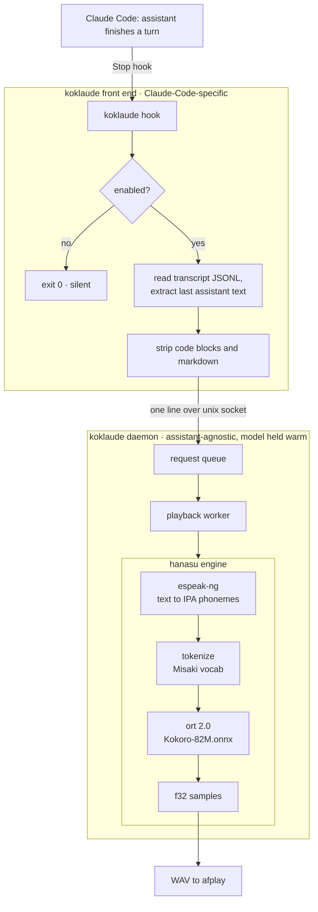

# Architecture

koklaude is a single Rust binary with a few subcommands. It has two halves:

- a **front end** that knows about Claude Code (the Stop hook + transcript parsing), and
- an **engine + daemon** that knows nothing about any assistant — it just turns text into spoken audio.

Keeping that seam clean is what lets koklaude later speak for Codex, pi, or anything else without touching the engine.



## Components

Each unit has one job, a narrow interface, and can be tested alone.

| Unit | Job | In → Out |
|---|---|---|
| `transcript` | Parse the Stop-hook stdin JSON; pull the **last assistant turn** from the session JSONL. | path → `String` |
| `clean` | Markdown reply → speakable prose. Drops fenced + inline code, strips headings/lists/emphasis/links. Pure, heavily unit-tested. | `String` → `String` |
| `engine` | Wrap the model: load Kokoro ONNX + a voice once; `synth(text) → wav`. Phonemize → tokenize → `ort` inference → samples. | `String` → `Vec<u8>` (WAV) |
| `daemon` | Own one warm `engine`; accept socket connections; enqueue text; play serially. Idle-exit after 30 min. | socket loop |
| `client` | Front-end side: connect to the daemon (spawn it if absent), send text. Never blocks Claude Code. | `String` → `()` |
| `config` | `config.toml` (voice, speed, idle timeout) + the `enabled` toggle flag. | — |
| `paths` | Resolve everything under `~/.config/koklaude/`. | — |
| `setup` | `koklaude init`: download model, write default config, merge the Stop hook into `~/.claude/settings.json`, enable. | — |

## The engine pipeline (the only novel part)

The Kokoro-82M model is the same ONNX artifact every implementation uses. Our engine is just the wiring around it:

1. **Phonemize** — `espeak-ng` (invoked as an external CLI) turns text into IPA phonemes. It handles arbitrary words, names, technical jargon, and many languages — the cases a fixed embedded dictionary cannot. `hanasu` calls espeak-ng as a separate program (not linked), so the project stays MIT.
2. **Tokenize** — map the IPA phoneme string to the token ids Kokoro expects (the Misaki phoneme vocabulary — a small fixed table, no extra crate).
3. **Infer** — `ort` 2.0 runs the model: token ids + a per-voice style vector (+ speed) → audio samples.
4. **Emit** — samples → WAV → `afplay` (macOS).

`espeak-ng` is a runtime dependency of `hanasu`, invoked as an external CLI (not linked). `koklaude init` checks it is present.

**Known unknown to pin first:** Kokoro-82M's exact ONNX input contract — the tensor names/shapes for `input_ids`, `style`, `speed`, and the precise phoneme→id vocabulary. This is settled with a smoke test against the real model file before any further engine code (see [`plan.md`](plan.md)), using `kokoro-js` / `kokoro-onnx` as the reference spec.

## Runtime model: warm daemon

A cold model load is too slow to run on every reply. So:

- The **hook** is a thin client. If the socket is missing, it spawns `koklaude daemon` and waits for it to be ready.
- The **daemon** loads the model once and serves many replies over `~/.config/koklaude/daemon.sock`.
- Requests go on a **queue** and play one at a time — text is never dropped.
- After 30 minutes idle the daemon exits to free RAM; the next reply respawns it.

Deep dive — the socket wire protocol, connect-or-spawn, idle shutdown, and
stale-socket recovery: [`daemon-and-sockets.md`](daemon-and-sockets.md).

## Filesystem layout

```
~/.config/koklaude/            # state — relocatable via $KOKLAUDE_HOME
  ├─ kokoro-v1.0.onnx   model weights (downloaded by `init`)
  ├─ voices/            one style file per voice, <name>.bin (downloaded by `init`)
  ├─ config.toml        voice, speed, idle-timeout
  ├─ enabled            presence = speech on  (toggled by on/off)
  └─ daemon.sock        unix socket: hook ↔ daemon

~/.koklaude/logs/              # runtime logs — relocatable via $KOKLAUDE_LOG_DIR
  └─ koklaude.YYYY-MM-DD.jsonl daily JSON log (see logging.md)
```

Paths are overridable by environment variable; the full list is in the README's
[Configuration](../README.md#configuration) section.

## Failure policy

The hook must never block or fail Claude Code. Every error path — model missing, daemon unreachable, synth failure — is logged to stderr and the hook still exits `0`. Worst case: silence, never a stuck assistant.

## Extensibility

Only `transcript` (how to find the last reply) and the hook wiring are Claude-Code-specific. The engine and daemon take plain text over a socket. Adding another assistant = a new small adapter that produces text the same way:

```
Claude Code  ─┐
Codex        ─┼─▶  (per-assistant adapter: hook + transcript)  ─▶  koklaude daemon  ─▶  speech
pi           ─┘
```

No engine changes required.
