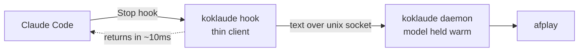
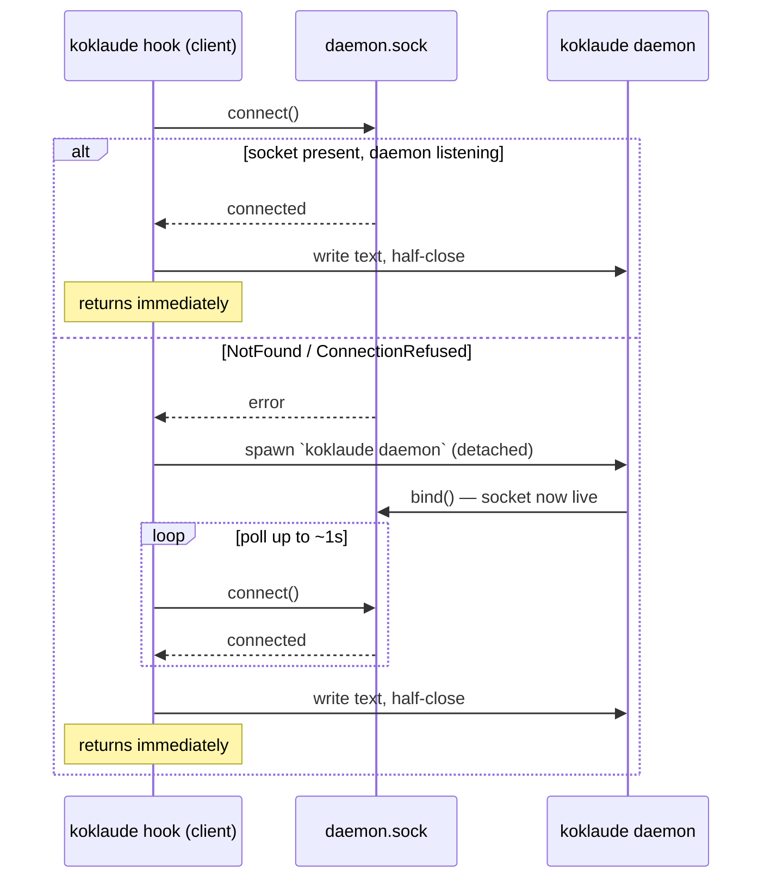
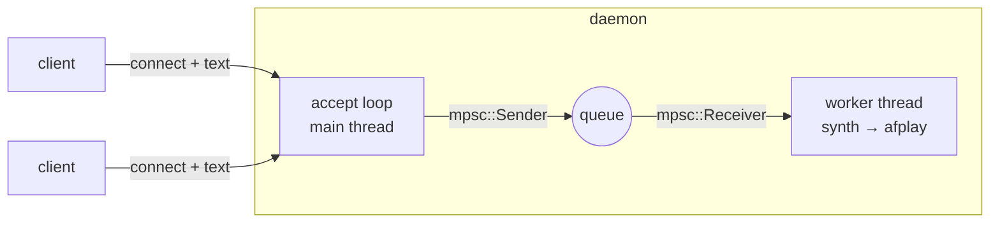

# The daemon and unix sockets

How koklaude speaks a reply *fast* without blocking Claude Code — and why that
needs a background daemon and a unix socket rather than just running the model
inline. This is a tour of the design for anyone curious about daemons and IPC;
it maps every idea to the code that implements it.

## The problem: the model is slow to load, fast to run

Kokoro-82M is an ONNX model. Loading it — reading the weights, initialising an
`ort` inference session — costs on the order of a second or two. *Running* it
(synthesising one reply) is much cheaper. Claude Code fires its **Stop hook**
every time the assistant finishes a turn, and it waits for that hook process to
exit before it considers the turn done.

So the naive design — `koklaude hook` loads the model, synthesises, plays, exits
— would tax **every single reply** with the cold-load cost and make you wait for
audio to finish playing before the prompt returns. Unacceptable.

The fix is the classic one: **keep the expensive thing warm in a long-lived
process, and talk to it over a socket.**



The hook is a **thin client**: it reads the reply, cleans it, hands the text to
the daemon over a socket, and returns immediately. The **daemon** owns the warm
model and does the slow work (synth + playback) on its own time. Claude Code
never waits on any of it.

Measured on this machine (`koklaude hook` fed a fixture transcript):

| Path | Hook returns in |
|---|---|
| Cold — daemon not running, hook spawns it | ~115 ms |
| Warm — daemon already up | ~11 ms |
| Disabled — `koklaude off` | ~11 ms |

The cold 115 ms is *not* the model load — it's just the time to spawn the daemon
process and hand off the text. The daemon loads the model in the background
*after* the hook has already returned.

## Why a unix domain socket

A daemon needs an address the client can reach. The options:

- **A TCP port** — works, but it's networked: reachable from other machines,
  needs a port number, shows up in `netstat`. Overkill for two processes on one
  laptop, and a small security footprint we don't want.
- **A named pipe / FIFO** — one-directional and awkward for a connection model.
- **A unix domain socket** — a socket that lives as a *file* on disk
  (`~/.config/koklaude/daemon.sock`) instead of on the network. Same
  `connect`/`accept`/`read`/`write` API as TCP, but local-only, permissioned by
  the filesystem, and with no port to manage.

Unix socket is the obvious fit, and Rust's standard library has everything we
need in `std::os::unix::net` — **no async runtime, no tokio, no extra crates.**
One daemon, one model, playback happens one reply at a time; there is no
concurrency that would earn an async runtime. (See `docs/decisions.md`.)

## The wire protocol: one connection, one request

The contract is deliberately the simplest thing that works
(`crates/koklaude/src/ipc.rs`):

> **One connection = one request.** The client connects, writes the reply text
> as UTF-8, and half-closes its write half. The daemon reads to **EOF** — and
> that EOF *is* the message boundary.

No length prefix, no delimiter, no framing header. Because each connection
carries exactly one message, there is nothing to disambiguate — "the message is
everything you read until the stream ends." It's fire-and-forget: the daemon
sends no reply.

```rust
// client side — write the bytes, then signal "I'm done writing"
stream.write_all(text.as_bytes())?;
stream.shutdown(Shutdown::Write)?;   // <- this is what makes the daemon's read return

// daemon side — read until that EOF
stream.read_to_string(&mut buf)?;
```

The `shutdown(Write)` is the quiet hero here. Without it, the daemon's
`read_to_string` would block forever waiting for more bytes, because the client
still *could* write more. Half-closing the write half sends the EOF that ends
the read, while (in principle) leaving the read half open. We don't read a
response, so the connection just closes after.

Reading as UTF-8 (`read_to_string`) also means a garbled non-text request fails
loudly rather than being played as noise.

## Connecting — or spawning the daemon if it isn't there

The hook can't assume the daemon is running: the first reply after you open your
laptop, or after a 30-minute idle shutdown, arrives with no daemon. So the
client does **connect-or-spawn** (`crates/koklaude/src/client.rs`):



Two error kinds mean "no daemon, go spawn one":

- **`NotFound`** — the socket file doesn't exist. No daemon has run (recently).
- **`ConnectionRefused`** — the socket *file* exists but nothing is listening on
  it. This is a **stale socket** left by a daemon that crashed or was killed
  (more on this below).

Any *other* connect error is a genuine failure and is reported, not retried.

### Spawning detached — the part that keeps Claude Code unblocked

When the client spawns the daemon, it must spawn it so that **Claude Code
doesn't end up waiting on the daemon too.** The trick:

```rust
Command::new(exe).arg("daemon")
    .stdin(Stdio::null())
    .stdout(Stdio::null())
    .stderr(Stdio::null())
    .spawn()?;
```

Claude Code waits for the hook by waiting for the hook's stdout/stderr pipes to
close. If the daemon *inherited* those pipes, Claude Code would block until the
daemon (which lives for 30 minutes!) exited. Redirecting the daemon's stdio to
`/dev/null` detaches it from those pipes, so the hook's pipes close the moment
the hook exits — and the orphaned daemon keeps running, reparented to pid 1
(`launchd` on macOS).

This was verified end-to-end: after the hook exits, the daemon is still alive and
serving. (We deliberately *don't* call `setsid` / double-fork — on macOS, stdio
redirection alone proved sufficient.)

### Why polling works without losing the request

Notice the daemon's `run()` does `bind()` **before** `Engine::load()`
(`crates/koklaude/src/daemon.rs`). That ordering matters: the socket becomes
connectable within milliseconds of spawn, long before the model finishes
loading. So the client's poll succeeds almost immediately, writes its text — and
that text simply **buffers in the socket** until the daemon finishes loading the
model and its accept loop starts reading. The request is never dropped waiting
for a cold model.

The poll budget is bounded (~1 second total) precisely so that a *broken* install
— where the daemon can never bind — stalls the hook for at most a second before
giving up silently, rather than hanging Claude Code.

## Inside the daemon: a queue and one worker

The daemon is two cooperating threads connected by an `mpsc` channel
(`crates/koklaude/src/daemon.rs`):



- The **accept loop** does nothing slow: accept a connection, read the request
  to EOF, push the string onto the queue, go back to accepting. A reply that
  takes 4 seconds to play never blocks the next connection from being accepted.
- The **worker thread** drains the queue and plays each reply **serially** —
  synthesise, then `afplay`, one at a time. This is a deliberate decision
  (`decisions.md` D7): if two replies arrive close together, the second
  **queues** behind the first rather than interrupting it or playing on top of
  it. Text is never dropped; audio never overlaps.

The channel *is* the queue. `mpsc` (multi-producer, single-consumer) is exactly
the right shape: many connections can enqueue, one worker dequeues.

## Idle shutdown — freeing the model when you walk away

Holding an ONNX model in RAM forever is wasteful if you've stopped working. So
the daemon shuts itself down after a configurable idle period
(`idle_timeout_minutes` in `config.toml`, default **30**). The next reply simply
respawns it via the connect-or-spawn flow above.

The mechanism is elegant because of how the worker already waits on the queue:

```rust
match rx.recv_timeout(idle) {
    Ok(text) => play(text),     // got work — play it, loop
    Err(_)   => return,         // Timeout (or queue closed) — stop serving
}
```

`recv_timeout` blocks for a reply, but gives up after `idle`. No reply for 30
minutes → it returns → the daemon cleans up and exits. The timeout logic is
factored into a pure `drain_until_idle` function with no engine and no `exit`
inside it, so it can be unit-tested with a 100 ms timeout instead of 30 minutes.

One wrinkle: the **accept loop** (main thread) is blocked in `incoming()` and
can't be politely interrupted with std alone. So once the worker decides it's
idle, it calls `std::process::exit(0)` to bring the whole process down. Nothing
is playing at that point (that's what "idle" means), so it's clean.

## Socket lifecycle — the stale-socket problem

Here's a sharp edge of unix sockets that trips everyone up:

> **`std` does not delete the socket file when the process exits.**

Bind a `UnixListener` to `daemon.sock`, then `kill` the process, and the *file*
`daemon.sock` is still sitting there — but nothing is listening on it. The next
daemon that tries to `bind()` the same path gets `AddrInUse`:

```
$ koklaude daemon          # gets killed (Ctrl-C, kill, crash, reboot leftover...)
$ koklaude daemon
Error: Address already in use (os error 48)   # <- without recovery
```

koklaude handles both ends of this:

1. **On clean exit** (idle shutdown), the worker `unlink`s the socket file on its
   way out. Tidy, but it only covers the graceful path — a `kill -9` or a crash
   runs *no* cleanup code.

2. **On startup**, `bind()` recovers a stale socket. This is the real safety net,
   because it doesn't depend on the previous daemon having exited cleanly:

```rust
match UnixListener::bind(socket) {
    Ok(listener) => Ok(listener),
    Err(e) if e.kind() == AddrInUse => {
        // File exists. Live daemon, or a stale corpse?
        if UnixStream::connect(socket).is_ok() {
            bail!("daemon already running");      // someone's listening — back off
        }
        std::fs::remove_file(socket)?;            // nobody home — it's stale
        UnixListener::bind(socket)                // rebind fresh
    }
    Err(e) => Err(e),
}
```

The **probe-connect** is the clever bit: `AddrInUse` alone can't tell you whether
a real daemon owns the socket or a dead one left it behind. So you try to
*connect*. If the connection succeeds, a live daemon is there — don't stomp on
it, bail. If it's refused, the socket is an orphan — delete it and rebind.

This is the same `ConnectionRefused`-means-stale signal the *client* uses to
decide to respawn. Together they make a killed daemon self-heal: next launch
(client-spawned or manual) unlinks the corpse and binds fresh. Verified by
`SIGKILL`-ing a daemon and confirming the next launch recovers with no error.

## The failure policy: silence, never a stuck assistant

Threading through all of this is one rule: **the hook must never block or fail
Claude Code.** A TTS toy is not allowed to wedge your coding session.

So `koklaude hook` (`crates/koklaude/src/hook.rs`) wraps its real work and
swallows *every* error, always exiting `0`:

```rust
pub fn run() -> Result<()> {
    if let Err(e) = speak_reply() {
        eprintln!("koklaude hook: {e:#}");   // log to stderr for the curious
    }
    Ok(())                                   // but always succeed
}
```

Disabled? Silent. Model not installed? The daemon fails to load, the hook logs
it and exits 0. Daemon unreachable, transcript malformed, socket gone? Logged,
exit 0. The worst thing that can ever happen is **no sound** — never a hung
prompt.

## Map: where each piece lives

| Concern | File |
|---|---|
| Wire protocol (`send` / `write_request` / `recv`) | `crates/koklaude/src/ipc.rs` |
| Bind + stale recovery, accept loop, worker, idle shutdown | `crates/koklaude/src/daemon.rs` |
| Connect-or-spawn client, detached spawn, retry | `crates/koklaude/src/client.rs` |
| Stop-hook entrypoint + always-exit-0 policy | `crates/koklaude/src/hook.rs` |
| Socket path, `idle_timeout` | `crates/koklaude/src/config.rs` |

## Inspecting it yourself

```sh
koklaude on                                   # enable speech (flag file)
koklaude daemon &                             # run the daemon in the foreground-ish
ls -l ~/.config/koklaude/daemon.sock          # the socket file (note the leading 's' in perms)
printf 'Hello from the socket' | nc -U ~/.config/koklaude/daemon.sock   # speak, bypassing the hook
```

`nc -U` connects to a **u**nix socket — it half-closes on EOF from the pipe, so
it satisfies the wire protocol exactly like the real client does.
